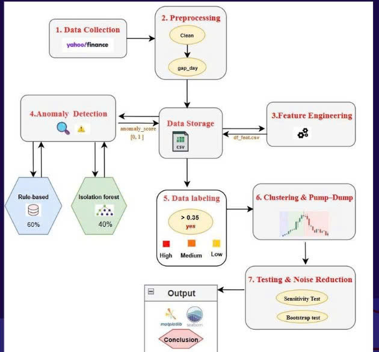

# Hybrid Anomaly Detection System for Stock Market Manipulation

A Data Science project that detects suspicious stock-trading sessions and screens for potential pump-and-dump patterns using a hybrid anomaly-detection pipeline.

The system combines financial rule-based signals with an unsupervised machine learning model, **Isolation Forest**, to identify unusual price and volume behavior from daily OHLCV data.

> **Academic-use disclaimer:** Detected events are risk signals generated by the pipeline. They are not confirmed cases of market manipulation and must not be treated as investment advice.

---

## System Architecture



The pipeline follows eight stages:

1. Data collection  
2. Data preprocessing and quality checks  
3. Financial feature engineering  
4. Rule-based anomaly detection  
5. Isolation Forest anomaly detection  
6. Hybrid scoring and risk labeling  
7. Anomaly clustering and pump-and-dump screening  
8. Visualization and dashboard analysis  

---

## Objectives

- Analyze historical daily OHLCV stock-market data.
- Detect unusual combinations of price movement and trading volume.
- Combine technical-analysis rules with unsupervised machine learning.
- Screen anomaly clusters for potential pump-and-dump behavior.
- Produce chart and dashboard-ready outputs for exploratory analysis.

---

## Dataset

The project contains historical daily OHLCV data for three stocks:

| Ticker | Company | Market |
|---|---|---|
| LKNCY | Luckin Coffee | NASDAQ |
| FLC | FLC Group | HOSE |
| VNM | Vinamilk | HOSE |

Each record contains:

- Date
- Open
- High
- Low
- Close
- Volume

### Data Sources

- **LKNCY:** Yahoo Finance data retrieved with `yfinance`.
- **FLC** and **VNM:** Vietnamese market data collected with `vnstock3`.

The main reproducible notebook demonstrates the complete pipeline on **LKNCY**. FLC and VNM are retained for comparative analysis and dashboard exploration.

---

## Data Preprocessing

The preprocessing stage performs the following tasks:

- Converts price and volume columns to numeric values.
- Parses the `Date` column and sorts records chronologically.
- Removes missing and duplicate observations.
- Checks for invalid OHLC values using:

```text
Low ≤ Open / Close ≤ High
```

- Logs zero-value or invalid observations.
- Detects trading-date gaps greater than three calendar days.

Generated outputs:

```text
df_clean.csv
data_issue_log.csv
```

---

## Feature Engineering

The system creates financial and statistical features that represent price movement, volatility, market trend, and abnormal trading volume.

| Feature Group | Features |
|---|---|
| Price movement | Daily Return, Log Return, Close-to-Open Return |
| Intraday volatility | Intraday Range, Range Percentage |
| Rolling volatility | 120-day Return Volatility |
| Volume behavior | 30-day Volume Ratio, 120-day Volume Z-score |
| Price anomaly | 120-day Return Z-score |
| Trend | MA-5, MA-20, MA-50 |
| Technical indicators | RSI-14, Bollinger Bands, MACD, ATR-14 |

Key calculations:

```text
Daily Return = (Close_t - Close_(t-1)) / Close_(t-1)

Volume Ratio = Volume_t / Mean(Volume_(t-30:t))

Volume Z-score =
(Volume_t - RollingMean_120(Volume)) / RollingStd_120(Volume)
```

Generated output:

```text
df_feat.csv
```

---

## Methodology

### 1. Rule-Based Anomaly Detection

The rule-based component uses financial conditions that may indicate unusual trading activity.

```text
Volume-Return Signal:
Volume Ratio > 1.8 AND |Daily Return| > 2%

Bollinger Breakout:
Close > Upper Bollinger Band × 1.002
AND Volume > 1.2 × 30-day average volume

RSI-Volume Signal:
RSI-14 > 70 AND Volume Ratio > 1.5
```

The system also assigns a Z-score band:

| Band | Condition |
|---|---|
| High | `|ret_z| ≥ 2.0` or `vol_z ≥ 2.0` |
| Medium | `1.2 ≤ |ret_z| < 2.0` or `1.2 ≤ vol_z < 2.0` |
| Low | `0.8 ≤ |ret_z| < 1.2` or `0.8 ≤ vol_z < 1.2` |

The rule score is calculated from Z-score intensity, binary financial-rule signals, and a severity bonus:

```text
Rule Score =
0.35 × Z-score Intensity
+ 0.65 × Binary Rule Signals
+ Bonus for active signals / high Z-band
```

The score is clipped to the range `[0, 1]`.

Generated output:

```text
df_rule.csv
```

---

### 2. Isolation Forest

Isolation Forest detects unusual trading observations without requiring manually labeled manipulation events.

#### Input Features

```text
log_return
vol_ratio
range_pct
RSI_14
ret_z
vol_z
volatility_120
MACD_hist
BB_pos
ATR_14
```

#### Model Configuration

```python
IsolationForest(
    n_estimators=500,
    contamination=0.01,
    random_state=42
)
```

The input features are standardized with `StandardScaler`. The model's decision function is inverted and normalized into an `ml_score` between `0` and `1`, where higher values represent more unusual behavior.

Generated output:

```text
df_ml.csv
```

---

### 3. Hybrid Ensemble and Risk Labeling

The final anomaly score combines the machine-learning and financial-rule components:

```text
Final Anomaly Score =
0.4 × ML Score + 0.6 × Rule-Based Score
```

A trading session is flagged as suspicious when:

```text
Final Anomaly Score ≥ 0.40
```

Severity levels are assigned using the final score, return Z-score, and volume Z-score:

| Severity | Criteria |
|---|---|
| High | `|ret_z| ≥ 3`, `vol_z ≥ 3`, or score `≥ 0.75` |
| Medium | score `0.55–0.75`, or Z-score between `2–3` |
| Low | score `0.40–0.55`, or Z-score between `1.5–2` |
| Normal | No suspicious signal |

Generated output:

```text
df_final_output.csv
```

---

### 4. Anomaly Clustering and Pump-and-Dump Screening

Suspicious sessions are grouped into anomaly clusters when the time gap between signals is no more than two calendar days.

A cluster is flagged as a **potential pump-and-dump candidate** when:

1. It contains at least one observation with:

```text
Volume Z-score ≥ 2
```

2. The closing price declines by at least 5% within the following three trading sessions after the local peak:

```text
Price Drop ≤ -5%
```

Each cluster contains:

- Start and end date
- Cluster length
- Number of high-severity sessions
- Maximum volume Z-score
- Average return
- Post-event returns after 1, 3, and 5 days
- Pump-and-dump candidate flag

Generated output:

```text
clusters.csv
```

---

### 5. Sensitivity Analysis

The rule-based component is tested across multiple Z-score thresholds.

| Z-score Threshold | Detected Sessions | Detection Rate |
|---|---:|---:|
| 2.0 | 99 | 7.86% |
| 2.5 | 59 | 4.68% |
| 3.0 | 40 | 3.17% |

Higher thresholds generate fewer alerts and provide stricter anomaly screening.

Generated output:

```text
validation_summary.csv
```

---

## Results

### LKNCY Pipeline Summary

The main notebook processes LKNCY data from May 2019 to December 2024.

| Metric | Result |
|---|---:|
| Cleaned daily OHLCV records | 1,416 |
| Feature-ready sessions | 1,260 |
| Suspicious sessions detected | 143 |
| Detection rate | 11.35% |
| High-severity sessions | 48 |
| Medium-severity sessions | 58 |
| Low-severity sessions | 37 |
| Anomaly sequences identified | 74 |
| Longest consecutive anomaly sequence | 8 sessions |
| Clusters with positive 3-day post-event movement | 50.0% |

The results show that anomalies may represent temporary volatility, corporate events, speculative activity, or potential market irregularities. They should be used to prioritize manual review, not as proof of misconduct.

### Project Evaluation Summary

The project report compares the hybrid ensemble with individual detection approaches over 1,260 trading sessions.

| Model | Precision | Recall | F1-score | ROC-AUC |
|---|---:|---:|---:|---:|
| Isolation Forest | 0.587 | 0.607 | 0.597 | 0.955 |
| Z-score Baseline | 0.562 | 0.885 | 0.688 | 0.974 |
| Hybrid Ensemble | **0.700** | 0.803 | **0.748** | **0.983** |

> **Evaluation note:** These metrics follow the project's evaluation setup. The repository does not yet include independently verified ground-truth manipulation labels, so the reported values should be interpreted as project-level evaluation results rather than definitive real-world detection performance.

### Computational Efficiency

| Metric | Result |
|---|---:|
| Isolation Forest training time | ~0.4568 seconds |
| Average inference time | ~32.7 µs/sample |
| Approximate RAM usage | ~5 MB |

### Comparative Findings

- **VNM:** Predominantly stable behavior with lower volatility.
- **FLC:** Strong abnormal volatility, particularly during 2021–2022.
- **LKNCY:** Caution-level anomaly signals, especially around high-volatility periods.

---

## Visual Outputs

The notebook generates the following files:

```text
fig_price_anomalies.png
bieudo_top15_ngay.png
bieudo_muc_do_bat_thuong.png
heatmap_retZ_volZ.png
heatmap_lich_bat_thuong.png
```

The visualizations support:

- Closing-price charts with anomaly markers.
- Severity distribution of detected sessions.
- Top anomaly-score dates.
- Return Z-score versus volume Z-score distributions.
- Time-based anomaly heatmaps.
- Cluster-level post-event behavior.

---

## Repository Structure

```text
.
├── assets/
│   └── system_architecture.png
│
├── data/
│   └── raw/
│       ├── LKNCY.csv
│       ├── FLC/
│       └── VNM/
│
├── plots/
│
├── hybrid_stock_anomaly_detection.ipynb
├── app.py
├── requirements.txt
└── README.md
```

Common generated files:

```text
df_clean.csv
df_feat.csv
df_rule.csv
df_ml.csv
df_final_output.csv
clusters.csv
data_issue_log.csv
validation_summary.csv
```

---

## Technologies

- Python
- Pandas
- NumPy
- Scikit-learn
- Isolation Forest
- StandardScaler
- MinMaxScaler
- Matplotlib
- Seaborn
- yfinance
- vnstock3
- Jupyter Notebook
- Power BI

---

## Installation

Clone the repository:

```bash
git clone https://github.com/khiemdong2005/Hybrid_Anomaly_Detection_System.git
cd Hybrid_Anomaly_Detection_System
```

Install dependencies:

```bash
pip install -r requirements.txt
```

---

## Usage

Open the main notebook:

```bash
jupyter notebook
```

Then run:

```text
hybrid_stock_anomaly_detection.ipynb
```

Before running the notebook, update the data-loading cell to use a relative path, for example:

```python
df = pd.read_csv("data/raw/LKNCY.csv")
```

Run all cells sequentially to generate cleaned data, engineered features, anomaly scores, clusters, validation summaries, and visualizations.

---

## Limitations

- The project combines unsupervised detection with heuristic financial rules.
- An anomaly signal does not confirm market manipulation.
- Isolation Forest uses a fixed `contamination=0.01`.
- The current notebook does not normalize events against broad-market movement such as the VN-Index or NASDAQ index.
- The repository does not include independently verified manipulation labels.
- The current validation script includes a permutation-style check that is exploratory and should not be treated as formal statistical proof.
- Results must not be used as financial or investment advice.

---

## Future Work

- Add broad-market index normalization.
- Integrate financial-news sentiment analysis with NLP.
- Evaluate Autoencoder-based anomaly detection.
- Validate against independently confirmed manipulation cases.
- Extend analysis to more tickers and industry sectors.
- Build a real-time dashboard for continuous anomaly monitoring.

---

## Disclaimer

This repository is developed for educational and academic research purposes only.

It does not provide investment advice and does not confirm that a company, stock, or trading session was involved in market manipulation.
